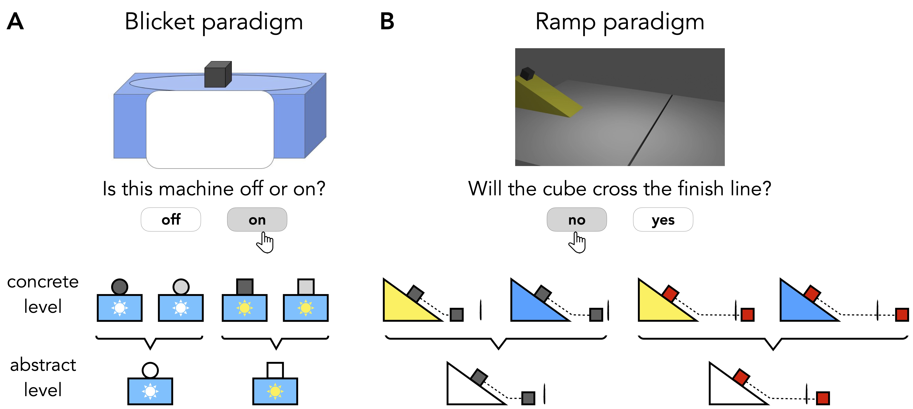

# Constructing causal stories

This repository contains the experiments, data, analyses, and figures for the paper **"Constructing causal stories: How mental models shape memory, prediction, and generalization"**.

- [Constructing causal stories](#constructing-causal-stories)
	- [Introduction](#introduction)
	- [Repository structure](#repository-structure)
		- [code](#code)
			- [blender](#blender)
			- [experiments](#experiments)
			- [python](#python)
			- [R](#r)
		- [data](#data)
		- [figures](#figures)
	- [Pre-registrations](#pre-registrations)
		- [Experiment 1](#experiment-1)
		- [Experiment 2](#experiment-2)
		- [Experiment 3](#experiment-3)

## Introduction 

How do people learn to predict what happens next? On one account, people do so by building mental models that mirror aspects of the causal structure of the world. Accordingly, people tell a story of how the data was generated, focusing on goal-relevant information. On another account, people make predictions by learning simple mappings from relevant features of the situation to the outcome. Here, we provide evidence for the causal account. Across three experiments and two paradigms, we find that people misremember what happened, predict incorrectly what will happen, and generalize to novel situations in a way that's consistent with the causal account and inconsistent with a feature-based alternative. People spontaneously construct causal models that compress experience to privilege causally relevant information. These models organize how we remember the past, predict the future, and generalize to novel situations.



## Repository structure 

```
.
├── code
│   ├── blender
│   ├── experiments
│   ├── python
│   └── R
├── data
│   ├── experiment1
│   ├── experiment2
│   └── experiment3
└── figures
    ├── diagrams
    ├── plots
    └── stimuli
```

### code 

#### blender

- Blender files used for rendering 3D stimulations. 
- See `code/blender/README.md` for details. 


#### experiments 

- Experiment code. See the readme files within the experiment folders for additional information. 

#### python

- Python files used for running physical simulations + implementation of the causal abstraction model. 
- See `code/python/README.md` for details. 

#### R

- R files used for data wrangling, visualization, and for fitting the features model. 

### data

Raw data files from each experiment. 

### figures

All the figures in the paper and experiment stimuli. 

## Pre-registrations 

Links to all the pre-registrations.

### Experiment 1 

- [feedback condition](https://osf.io/qyp9j/?view_only=5fd79e317c1e43f8a6b9b9f9ceb4dfdb)
- [no feedback condition](https://osf.io/stzj3/?view_only=438735d8d5974a62b8f2a1192482dec6)
- [short condition](https://osf.io/8r6qd/?view_only=627f5b44fce6424fa2678aa896d06019)
- [conjunctive condition](https://osf.io/3fmnc/?view_only=37d7c01929a54dde981f34bc4646c85e)

### Experiment 2

- [long condition](https://osf.io/z7hr6/?view_only=40dbb736cae74859b2c1d201ea392063) 
- [short condition](https://osf.io/hzfx7/?view_only=5e41d9a3bff74669b7d89a87cdc95210)
- [conjunctive condition](https://osf.io/5jt6c/?view_only=0ad4d5b8870e4464a930d84241bb2031) 

### Experiment 3 

- [both conditions](https://osf.io/v5sq3/?view_only=971803f92fc94ce2b07682d87b6cc232)