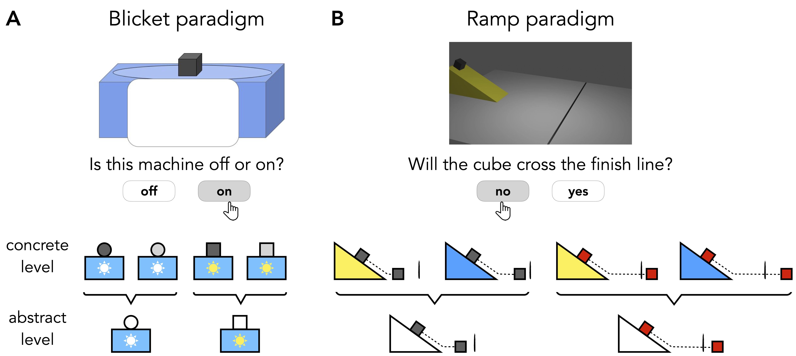

# Constructing causal stories

This repository contains the experiments, data, analyses, and figures for the paper [**"Constructing causal stories: How mental models shape memory, prediction, and generalization"**](https://osf.io/preprints/psyarxiv/6z9t7).

- [Constructing causal stories](#constructing-causal-stories)
	- [Introduction](#introduction)
	- [Repository structure](#repository-structure)
		- [code](#code)
			- [blender](#blender)
			- [python](#python)
			- [R](#r)
		- [data](#data)
		- [docs](#docs)
		- [figures](#figures)
	- [Pre-registrations](#pre-registrations)
		- [Experiment 1](#experiment-1)
		- [Experiment 2](#experiment-2)
		- [Experiment 3](#experiment-3)
	- [Experiment demos](#experiment-demos)
		- [Experiment 1](#experiment-1-1)
		- [Experiment 2](#experiment-2-1)
		- [Experiment 3](#experiment-3-1)
	- [CRediT author statement](#credit-author-statement)

## Introduction 

How do people learn to predict what happens next? On one account, people do so by building mental models that mirror aspects of the causal structure of the world. Accordingly, people tell a story of how the data was generated, focusing on goal-relevant information. On another account, people make predictions by learning simple mappings from relevant features of the situation to the outcome. Here, we provide evidence for the causal account. Across three experiments and two paradigms, we find that people misremember what happened, predict incorrectly what will happen, and generalize to novel situations in a way that's consistent with the causal account and inconsistent with a feature-based alternative. People spontaneously construct causal models that compress experience to privilege causally relevant information. These models organize how we remember the past, predict the future, and generalize to novel situations.



## Repository structure 

```
.
├── code
│   ├── blender
│   ├── python
│   └── R
├── data
│   ├── experiment1
│   ├── experiment2
│   └── experiment3
├── docs
│   ├── analysis
│   ├── experiment1
│   ├── experiment2
│   └── experiment3
└── figures
    ├── diagrams
    ├── plots
    └── stimuli
```

### code 

#### blender

- Blender files used for rendering 3D stimulations. 
- See `code/blender/README.md` for details. 

#### python

- Python files used for running physical simulations + implementation of the causal abstraction model. 
- See `code/python/README.md` for details. 

#### R

- R files used for data wrangling, visualization, and for fitting the features model. 
- `causal_stories.Rmd` depends on modeling results produced with python (specifically, it reads in `model_vs_human_comparison.csv`).

### data

Raw data files from each experiment. 

### docs 

- `analysis/` has the rendered RMarkdown document which can also access [here](https://cicl-stanford.github.io/causal_stories/analysis/).
- The `experiment/` code folders contain the code for each experiment. See the readme files within the experiment folders for additional information. You can try out demos of the experiments by clicking on the links in [Experiment demos](#experiment-demos).

### figures

All the figures in the paper and experiment stimuli. 

## Pre-registrations 

### Experiment 1 

- [feedback condition](https://osf.io/qyp9j)
- [no feedback condition](https://osf.io/stzj3)
- [short condition](https://osf.io/8r6qd)
- [conjunctive condition](https://osf.io/3fmnc)

### Experiment 2

- [long condition](https://osf.io/z7hr6) 
- [short condition](https://osf.io/hzfx7)
- [conjunctive condition](https://osf.io/5jt6c) 

### Experiment 3 

- [both conditions](https://osf.io/v5sq3)

## Experiment demos 

Links to demos of the different experiments.

### Experiment 1 

- [feedback condition](https://cicl-stanford.github.io/causal_stories/experiment1/feedback/color_off/index.html)
- [no feedback condition](https://cicl-stanford.github.io/causal_stories/experiment1/no_feedback/index.html?condition=color_off)
- [short condition](https://cicl-stanford.github.io/causal_stories/experiment1/short/index.html?condition=color_off)
- [conjunctive condition](https://cicl-stanford.github.io/causal_stories/experiment1/conjunctive/index.html?condition=lc_lc)

### Experiment 2

- [long condition](https://cicl-stanford.github.io/causal_stories/experiment2/long/index.html?condition=1) 
- [short condition](https://cicl-stanford.github.io/causal_stories/experiment2/short/index.html?condition=1)
- [conjunctive condition](https://cicl-stanford.github.io/causal_stories/experiment2/conjunctive/index.html?condition=1) 

### Experiment 3 

- [forward facing](https://cicl-stanford.github.io/causal_stories/experiment3/index.html?condition=1_f)
- [backward facing](https://cicl-stanford.github.io/causal_stories/experiment3/index.html?condition=1_b)

## CRediT author statement 

For details about the different terms see [here](https://www.elsevier.com/authors/policies-and-guidelines/credit-author-statement). 

| Term                       | Steven | Chuqi | Paul | Tobi |
|----------------------------|--------|-------|------|------|
| Conceptualization          | x      |       | x    | x    |
| Methodology                | x      | x     |      | x    |
| Software                   | x      | x     |      | x    |
| Validation                 | x      | x     |      | x    |
| Formal analysis            | x      |       |      | x    |
| Investigation              | x      |       |      |      |
| Data Curation              | x      | x     |      |      |
| Writing - Original Draft   |        |       |      | x    |
| Writing - Review & Editing | x      | x     | x    | x    |
| Visualization              |        |       |      | x    |
| Supervision                |        |       | x    | x    |
| Project administration     | x      |       |      | x    |
| Funding acquisition        |        |       |      | x    |